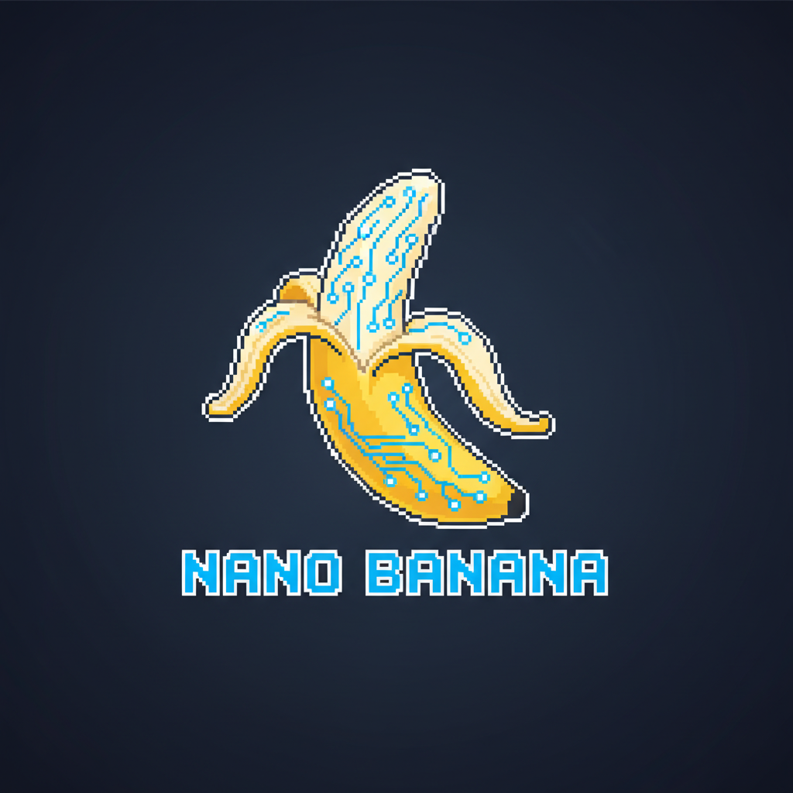

<p align="center">
  
</p>

<h1 align="center">Nano Banana MCP</h1>

<p align="center">
  <strong>MCP server for Google Gemini image generation with configurable model support.</strong>
</p>

<p align="center">
  <a href="#features">Features</a> &bull;
  <a href="#setup">Setup</a> &bull;
  <a href="#models">Models</a> &bull;
  <a href="#tools">Tools</a>
</p>

<p align="center">
  <a href="https://ccstrategic.io/">Website</a> &bull;
  <a href="https://www.youtube.com/@charlieautomates">YouTube</a> &bull;
  <a href="https://start.ccstrategic.io/skool">Skool Community</a>
</p>

---

## What is this?

A fork of [nano-banana-mcp](https://github.com/ConechoAI/Nano-Banana-MCP) with one critical upgrade: **configurable model selection** via environment variable.

The original package hardcodes `gemini-2.5-flash-image-preview` (shut down January 2026). This fork defaults to `gemini-3.1-flash-image-preview` and lets you swap models without touching code.

## Features

- Generate images from text prompts
- Edit existing images with natural language
- Iterative editing (continue refining the last image)
- Multi-image reference support (style transfer, combining elements)
- **Configurable aspect ratio** (1:1, 16:9, 9:16, 3:2, 2:3, 4:3, 3:4, 4:5, 5:4, 21:9, and more)
- **Configurable Gemini model via `GEMINI_MODEL` env var**

## Setup

### Claude Code / Cursor

Add to your `.mcp.json`:

```json
{
  "mcpServers": {
    "nano-banana": {
      "type": "stdio",
      "command": "node",
      "args": ["/path/to/nanobanana-mcp/dist/index.js"],
      "env": {
        "GEMINI_API_KEY": "your-api-key-here",
        "GEMINI_MODEL": "gemini-3.1-flash-image-preview"
      }
    }
  }
}
```

### Install Dependencies

```bash
git clone https://github.com/charlesdove977/nanobanana-mcp.git
cd nanobanana-mcp
npm install
```

### Get a Gemini API Key

1. Go to [Google AI Studio](https://aistudio.google.com/apikey)
2. Create a new API key
3. Add it to your MCP config as `GEMINI_API_KEY`

## Models

Set `GEMINI_MODEL` in your env to any of these (or omit it to use the default):

| Model ID | Tier | Price | Best For |
|---|---|---|---|
| `gemini-3.1-flash-image-preview` | Flash (default) | ~$0.045/img | Speed + quality balance |
| `gemini-3-pro-image-preview` | Pro | ~$0.134/img | Highest quality, best text rendering |
| `gemini-2.5-flash-image` | Legacy Flash | ~$0.039/img | Budget, high-volume |

All models support both generation and editing through the same API.

## Tools

| Tool | Description |
|---|---|
| `generate_image` | Create a new image from a text prompt (optional `aspectRatio`) |
| `edit_image` | Modify an existing image file with a prompt (optional `aspectRatio`) |
| `continue_editing` | Keep refining the last generated/edited image (optional `aspectRatio`) |
| `get_last_image_info` | Check the path and size of the last image |
| `configure_gemini_token` | Set API key at runtime |
| `get_configuration_status` | Check if API key is configured |

### Aspect Ratios

All image tools accept an optional `aspectRatio` parameter. Supported values:

`1:1` `2:3` `3:2` `3:4` `4:3` `4:5` `5:4` `9:16` `16:9` `21:9` `1:4` `1:8` `4:1` `8:1`

### Examples

**Generate (default 1:1):**
> "A futuristic city skyline at sunset with flying cars"

**Generate (16:9 widescreen):**
> prompt: "A futuristic city skyline at sunset with flying cars", aspectRatio: "16:9"

**Edit:**
> Edit `photo.png`: "Remove the background and replace with a gradient"

**Continue editing:**
> "Make the colors more vibrant and add lens flare"

## Image Storage

Generated images are saved to `./generated_imgs/` in your working directory (macOS/Linux) or `~/Documents/nano-banana-images/` (Windows).

## Credits

Forked from [ConechoAI/Nano-Banana-MCP](https://github.com/ConechoAI/Nano-Banana-MCP). Updated with configurable model support and latest Gemini models.

## License

MIT
